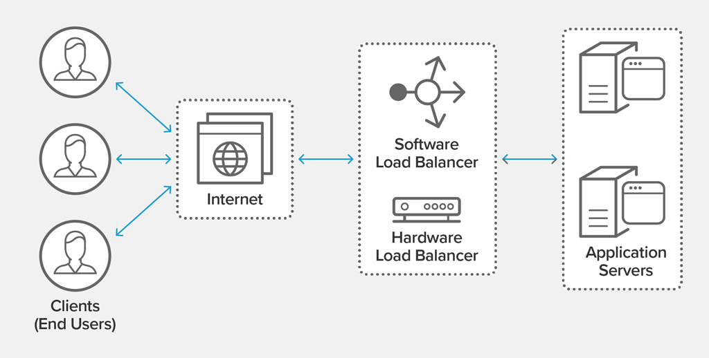
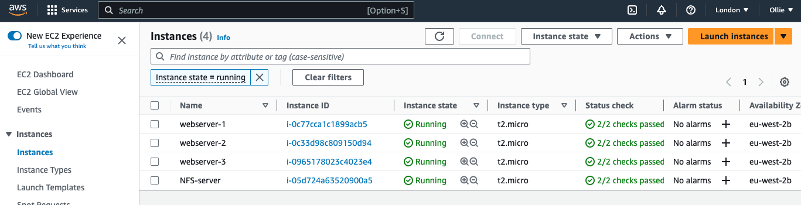
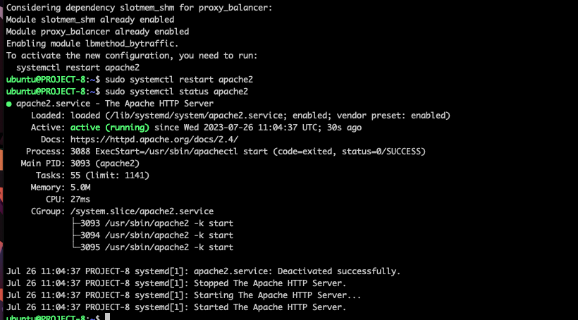
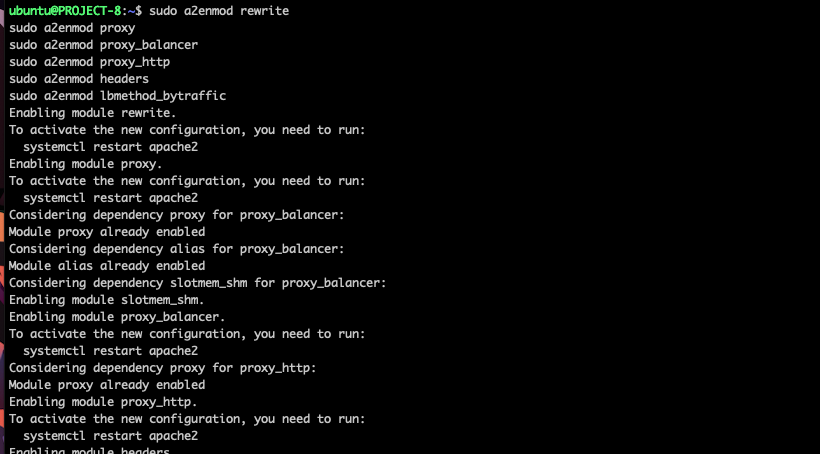

### LOAD BALANCER SOLUTION WITH APACHE

Load balancing refers to efficiently distributing incoming network traffic across a group of backend servers, also known as a server farm or server pool.

Modern high‑traffic websites must serve hundreds of thousands, if not millions, of concurrent requests from users or clients and return the correct text, images, video, or application data, all in a fast and reliable manner. To cost‑effectively scale to meet these high volumes, modern computing best practice generally requires adding more servers.

A load balancer acts as the “traffic cop” sitting in front of your servers and routing client requests across all servers capable of fulfilling those requests in a manner that maximizes speed and capacity utilization and ensures that no one server is overworked, which could degrade performance. If a single server goes down, the load balancer redirects traffic to the remaining online servers. When a new server is added to the server group, the load balancer automatically starts to send requests to it.

## CONFIGURE APACHE AS A LOAD BALANCER

The first thing we need to do is create an ubuntu server EC2 instance

Open TCP port 80 on the ubuntu server EC2 instance 

Install Apache Load balancer on the new server running the below command:

`sudo apt update` 

`sudo apt install apache2 -y`

`sudo apt-get install libxml2-dev `

The below modules will enable apache2 to work and be configured properly when installed,

`sudo a2enmod rewrite`
`sudo a2enmod proxy`
`sudo a2enmod proxy_balancer`
`sudo a2enmod proxy_http`
`sudo a2enmod headers`
`sudo a2enmod lbmethod_bytraffic`

To make sure apache is up and running, run command `sudo systemctl status apache2`

We have to configure LoadBalancer. To do that we have to open up the vi editor using the below command;

'sudo vi /etc/apache2/sites-available/000-default.conf`

Edit the folder by pasting the below in it:

> <Proxy "balancer://mycluster">
               BalancerMember http://<WebServer1-Private-IP-Address>:80 loadfactor=5 timeout=1
               BalancerMember http://<WebServer2-Private-IP-Address>:80 loadfactor=5 timeout=1
               ProxySet lbmethod=bytraffic
               # ProxySet lbmethod=byrequests
        </Proxy>

        ProxyPreserveHost On
        ProxyPass / balancer://mycluster/
        ProxyPassReverse / balancer://mycluster/

The above configuration is meant for loadbalancer to map the IP addresses such that webservers can be reached from the loadbalancer.